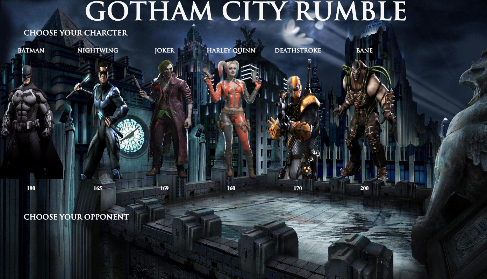

# RPG Game

## Description of the Site

RPG Game that allows user to pick a character and fight against the remaining characters.

## Pictures of the Site

[Gotham City Rumble](https://jccall.github.io/unit-4-game/)

## Built With
- [HTML](https://developer.mozilla.org/en-US/docs/Web/HTML)

- [CSS](https://developer.mozilla.org/en-US/docs/Web/CSS)

- [JavaScript](https://developer.mozilla.org/en-US/docs/Web/JavaScript)

- [Jquery](https://jquery.com/)

## NPM's Used

- [Express](https://www.npmjs.com/package/express)
- [Axios](https://www.npmjs.com/package/axios)
- [bcrypt](https://www.npmjs.com/package/bcrypt)
- [dotenv](https://www.npmjs.com/package/dotenv)
- [Express-Handlebars](https://www.npmjs.com/package/express-handlebars)
- [mySQL2](https://www.npmjs.com/package/mysql2)
- [Sequelize](https://www.npmjs.com/package/sequelize)

## Version

- [Github](https://github.com/)

## Deployment

- [Github](https://github.com/)

# Authors

- [Jordan Call](https://github.com/JCCALL)
